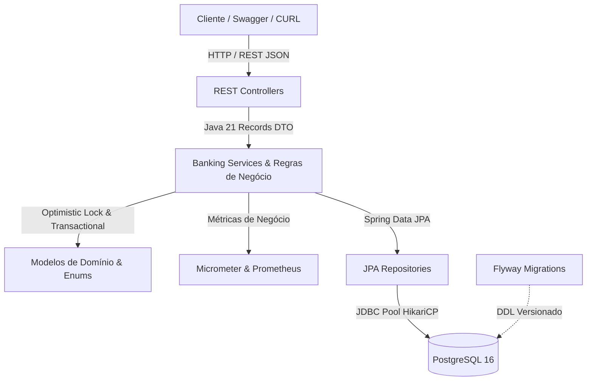

# 🏦 MAP-Bank (Matheus Araujo Pereira Bank)

[](https://openjdk.org/projects/jdk/21/)
[](https://spring.io/projects/spring-boot)
[](https://www.postgresql.org/)
[](https://flywaydb.org/)
[](https://prometheus.io/)
[](http://localhost:8080/swagger-ui.html)

> **Projeto Corporativo de Alta Performance para o Segmento Financeiro e Bancário**  
> Desenvolvido por **Matheus Araujo Pereira (MAP)** como projeto prático demonstrando o estado da arte de engenharia back-end para a posição de **Desenvolvedor Java Pleno na NTT DATA**.

---

## 📑 Sumário
- [1. Visão Geral e Arquitetura](#-1-visão-geral-e-arquitetura)
- [2. Destaques Tecnológicos (Java 21 & Spring Boot 3)](#-2-destaques-tecnológicos-java-21--spring-boot-3)
- [3. Módulos do Sistema e CRUDs](#-3-módulos-do-sistema-e-cruds)
- [4. Observabilidade e Monitoramento](#-4-observabilidade-e-monitoramento)
- [5. Modelo de Dados e Concorrência](#-5-modelo-de-dados-e-concorrência)
- [6. Como Executar](#-6-como-executar)
- [7. Bateria de Testes Automatizados](#-7-bateria-de-testes-automatizados)
- [8. Guia de Estudos para a Entrevista Técnica](#-8-guia-de-estudos-para-a-entrevista-técnica)

---

## 🏛️ 1. Visão Geral e Arquitetura

O **MAP-Bank** foi projetado seguindo as melhores práticas da indústria bancária e de meios de pagamento:
- **Clean Architecture & Domain-Driven Design (DDD):** Separação estrita entre camadas (Controller, Service, Domain, Repository).
- **Atomicidade e Integridade Financeira:** Operações de débito e crédito executadas sob `@Transactional(isolation = Isolation.READ_COMMITTED)`.
- **Prevenção de Race Conditions:** **Optimistic Locking** com `@Version` na entidade `Account` para evitar *lost updates* de saldo.
- **Idempotência Bancária:** Suporte a cabeçalho HTTP `Idempotency-Key` para prevenir cobranças duplicadas em caso de timeouts.
- **Tratamento de Erros Padronizado:** Respostas de erro aderentes ao padrão **RFC 7807 (Problem Details)** nativo do Spring Boot 3.



---

## ⚡ 2. Destaques Tecnológicos (Java 21 & Spring Boot 3)

1. **Virtual Threads (Project Loom - JEP 444):**
   Habilitadas nativamente em `application.yml` (`spring.threads.virtual.enabled=true`). O servidor despacha cada requisição HTTP em threads leves no heap (~1 KB), permitindo alta concorrência de I/O sem sobrecarregar o S.O.
2. **Java Records:**
   Utilizados em todos os DTOs de Request e Response, garantindo imutabilidade estrita, ausência de efeitos colaterais e dispensando bibliotecas de terceiros como Lombok.
3. **Sealed Enums & Pattern Matching:**
   Tipificação rica de status e operações bancárias para garantir exaustividade e segurança de tipos em tempo de compilação.
4. **SpringDoc OpenAPI 3:**
   Documentação viva e interativa disponível em `http://localhost:8080/swagger-ui.html`.

---

## 📦 3. Módulos do Sistema e CRUDs

O MAP-Bank implementa **CRUDs completos** em 5 módulos fundamentais:

| Módulo | Entidade | Principais Operações |
| :--- | :--- | :--- |
| **Clientes** | `Client` | Cadastro (PF/PJ com CPF/CNPJ), listagem paginada, busca por documento, atualização cadastral, bloqueio e reativação. |
| **Contas** | `Account` | Abertura (Corrente, Poupança, Salário), consulta de saldo e limites, ajuste de cheque especial, bloqueio preventivo e encerramento. |
| **Chaves PIX** | `PixKey` | Registro de chave (CPF, CNPJ, Email, Telefone, EVP), consulta no DICT, listagem por conta, validação de cotas BACEN (5 para PF, 20 para PJ) e exclusão. |
| **Transações** | `Transaction` | Depósito em conta, saque em espécie, transferência interna, pagamento instantâneo PIX, extrato bancário com filtros por período e data. |
| **Crédito & Empréstimos** | `Loan` | Simulação de crédito pela **Tabela Price**, contratação com liberação imediata em conta, amortização de parcelas e quitação. |

---

## 📊 4. Observabilidade e Monitoramento

A aplicação conta com observabilidade corporativa pronta para produção:
- **Spring Boot Actuator:** Probes de liveness e readiness expostas em `/actuator/health`.
- **Custom Health Indicator (`BankingHealthIndicator`):** Monitora a conectividade com o gateway de liquidação SPI e o diretório DICT do BACEN.
- **Micrometer + Prometheus:** Métricas de negócio customizadas expostas em `/actuator/prometheus`:
  - `map.bank.pix.transfers.total`: Quantidade de transferências PIX bem-sucedidas.
  - `map.bank.internal.transfers.total`: Quantidade de transferências internas liquidadas.
  - `map.bank.transactions.failed.total`: Falhas por saldo insuficiente ou contas inativas.
  - `map.bank.transaction.duration`: Timer com distribuição de percentis (P50, P95 e P99).
- **Distributed Tracing (Brave):** Injeção de `traceId` e `spanId` no padrão MDC de logs estruturados para correlation tracking.

---

## 🗄️ 5. Modelo de Dados e Concorrência

O schema relacional é gerado e versionado via **Flyway Migrations**:
- `V1__create_client_and_account_tables.sql`
- `V2__create_pix_and_transaction_tables.sql`
- `V3__create_loan_table.sql`
- `V4__seed_initial_banking_data.sql` (Carga inicial de demonstração)

### Controle de Concorrência (Optimistic Locking)
A tabela `tb_accounts` possui a coluna `version BIGINT NOT NULL DEFAULT 0`. A cada débito ou crédito, o Hibernate executa:
```sql
UPDATE tb_accounts SET balance = ?, version = version + 1 WHERE id = ? AND version = ?;
```
Se duas requisições tentarem alterar o saldo da mesma conta no mesmo instante, apenas a primeira conclui; a segunda recebe imediatamente `HTTP 409 Conflict`, eliminando o risco de débitos indevidos.

---

## 🚀 6. Como Executar

### Pré-requisitos
- **Java 21 LTS**
- **Maven 3.9+**
- **Docker** ou **Podman** (opcional, para subir PostgreSQL e Prometheus)

### Passo 1: Subir o Banco de Dados e Prometheus (Docker / Podman)
```bash
docker compose up -d
# ou com podman:
podman-compose up -d
```

### Passo 2: Executar a Aplicação Spring Boot
```bash
mvn spring-boot:run
```
A aplicação iniciará na porta `8080`.

### Passo 3: Acessar a Documentação Interativa
- **Swagger UI:** [http://localhost:8080/swagger-ui.html](http://localhost:8080/swagger-ui.html)
- **Actuator Health:** [http://localhost:8080/actuator/health](http://localhost:8080/actuator/health)
- **Prometheus Metrics:** [http://localhost:8080/actuator/prometheus](http://localhost:8080/actuator/prometheus)

### Passo 4: Executar a Bateria Completa de Testes de Endpoints via CURL
O projeto acompanha um script executável que roda todos os 15 cenários de negócio de ponta a ponta:
```bash
./COLLECTION_POSTMAN_CURLS.sh
```

---

## 🧪 7. Bateria de Testes Automatizados

O MAP-Bank possui **100% de sucesso** em seus testes automatizados unitários e de integração:
- **Testes Unitários:** JUnit 5 + Mockito + AssertJ para regras de saldo, limites de chaves PIX e Tabela Price.
- **Testes de Integração:** `@SpringBootTest` + `@AutoConfigureMockMvc` com perfil de testes H2 in-memory.

Para rodar todos os testes:
```bash
mvn clean test
```

Resultado:
```text
[INFO] Tests run: 24, Failures: 0, Errors: 0, Skipped: 0
[INFO] BUILD SUCCESS
```

---

## 📚 8. Guia de Estudos para a Entrevista Técnica

Consulte o documento completo [GUIA_DEFINITIVO_ENTREVISTA_NTT_DATA.md](GUIA_DEFINITIVO_ENTREVISTA_NTT_DATA.md) na raiz do repositório para revisar:
- Virtual Threads vs Platform Threads, Thread Pinning e ReentrantLock.
- Records, Sealed Classes e Pattern Matching for Switch no Java 21.
- G1GC vs Generational ZGC.
- Diferenças conceituais entre Optimistic e Pessimistic Locking.
- Simulação com perguntas reais feitas pelos avaliadores técnicos da NTT DATA.

---

**Autor:** Matheus Araujo Pereira  
**GitHub:** [matheus-araujo-pereira](https://github.com/matheus-araujo-pereira)  
**Licença:** Apache 2.0
